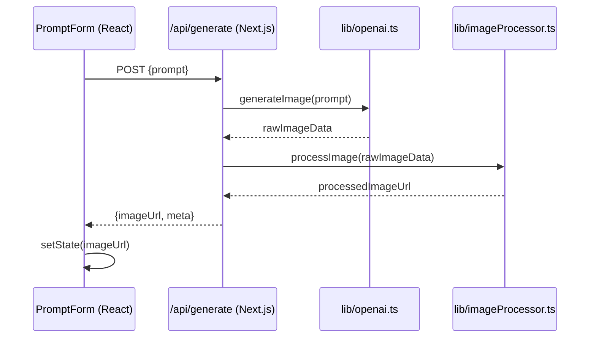

# Technical Overview – ImagineAI (`anubhabx/ImagineAI`)

> **Repository**: https://github.com/anubhabx/ImagineAI  
> **Default branch**: `master`  
> **Tech stack**: Next.js (App Router) • React • Tailwind CSS • TypeScript • npm / pnpm  

---

## Table of Contents

1. [High‑level Architecture](#high-level-architecture)  
2. [Directory Map & Responsibilities](#directory-map--responsibilities)  
3. [Core Data Flow](#core-data-flow)  
4. [External Services & Integrations](#external-services--integrations)  
5. [Operational Considerations](#operational-considerations)  
6. [Repository Statistics](#repository-statistics)  
7. [Getting Started (Developer Guide)](#getting-started-developer-guide)  
8. [Build & Deployment](#build--deployment)  
9. [Contributing & Code Quality](#contributing--code-quality)  

---

## High‑level Architecture

```mermaid
graph TD
    subgraph UI["Client‑side UI"]
        A[React components] --> B[Tailwind‑styled UI]
        B --> C[Next.js App Router (pages/route.tsx)]
    end

    subgraph Server["Next.js Server (Node)"]
        D[API Routes] --> E[Business Logic (lib/)]
        E --> F[External Service Calls]
    end

    subgraph Shared["Shared Types & Constants"]
        G[TypeScript interfaces] --> H[Constants (constants/)]
    end

    UI -->|fetch| D
    D -->|uses| G
    D -->|uses| H
    style UI fill:#f9f9f9,stroke:#333,stroke-width:1px
    style Server fill:#e8f5e9,stroke:#333,stroke-width:1px
    style Shared fill:#e3f2fd,stroke:#333,stroke-width:1px
```

* **Client side** – React components under `components/` and pages under `app/` (Next.js **App Router**). Tailwind CSS supplies the design system.
* **Server side** – API routes defined in `app/api/…` (or `pages/api/` if legacy). They call reusable helper functions inside `lib/`.
* **Shared layer** – `types/` houses global TypeScript definitions; `constants/` stores static configuration (e.g., environment variable defaults, UI strings, feature flags).

All code is compiled with **TypeScript**; linting & formatting typically delegated to `eslint` / `prettier` (present in the repo's `package.json` scripts).

---

## Directory Map & Responsibilities

| Directory | Primary Purpose | Notable Files / Sub‑folders |
|-----------|----------------|-----------------------------|
| `app/` | **Next.js App Router** – page components, layout, and API routes. | `layout.tsx`, `page.tsx`, `api/` (REST/GraphQL endpoints) |
| `components/` | Reusable UI building blocks, usually functional components. | `Header.tsx`, `ImageGenerator.tsx`, `PromptForm.tsx` |
| `constants/` | Static, compile‑time values (env defaults, UI strings, feature toggles). | `index.ts`, `ui.ts`, `features.ts` |
| `lib/` | Business‑logic utilities, external‑service wrappers, data‑processing helpers. | `openai.ts`, `imageProcessor.ts`, `auth.ts` |
| `public/` | Public assets served as‑is (favicon, static images, robots.txt). | `favicon.ico`, `logo.svg` |
| `types/` | Global TypeScript interfaces & enums shared across the codebase. | `prompt.d.ts`, `image.d.ts`, `apiResponse.d.ts` |
| `styles/` (optional) | Tailwind configuration overrides, global CSS. | `globals.css`, `tailwind.config.js` |
| `tests/` (currently absent) | Intended location for unit/integration tests (Jest, React Testing Library). | — |
| `README.md` | Project introduction for humans. | — |
| `package.json` / `package-lock.json` | Dependency & script definitions. | — |
| `pnpm-lock.yaml` (if pnpm used) | PNPM lockfile (optional). | — |

> **Note** – The repository does not contain a dedicated `tests/` folder. Adding one is a high‑priority improvement.

---

## Core Data Flow

Below is the typical request lifecycle for the **image‑generation** feature (the primary domain of ImagineAI).

1. **User Interaction** – The user types a prompt in `PromptForm` component → `onSubmit` handler fires.
2. **Client Request** – The component calls `fetch('/api/generate', { method: 'POST', body: JSON.stringify({ prompt }) })`.
3. **Next.js API Route** – `app/api/generate/route.ts` receives the request, validates the payload using types from `types/prompt.d.ts`.
4. **Business Logic** – The route forwards the prompt to `lib/openai.ts` which wraps the OpenAI SDK / REST endpoint.
5. **External Service** – `lib/openai.ts` sends the prompt to the OpenAI **DALL·E** endpoint, receives a base‑64 image string or image URL.
6. **Post‑processing** – `lib/imageProcessor.ts` may resize, compress, or store the image in a CDN (e.g., Vercel Edge Config, Cloudinary) – this step is abstracted behind a helper function.
7. **Response** – Processed image data (URL + metadata) is returned as JSON to the API route, which forwards it back to the client.
8. **UI Update** – The client component updates local state (`useState`) and displays the image using the `ImageGenerator` component.



### Key Data Structures (excerpt)

```ts
// types/prompt.d.ts
export interface PromptPayload {
  prompt: string;
  style?: 'realistic' | 'cartoon' | 'abstract';
  size?: '512x512' | '1024x1024';
}

// lib/openai.ts
export async function generateImage(payload: PromptPayload): Promise<RawImageResponse> {
  // Calls OpenAI SDK...
}

// types/image.d.ts
export interface ImageResult {
  url: string;
  width: number;
  height: number;
  createdAt: string;
}
```

---

## External Services & Integrations

| Service | Usage | Integration Point | Config (env) |
|---------|-------|-------------------|--------------|
| **OpenAI (DALL·E / ChatGPT)** | Generate images from textual prompts. | `lib/openai.ts` (wrapper around official SDK) | `OPENAI_API_KEY` |
| **Vercel Edge Config / CDN** (optional) | Host generated images for low‑latency delivery. | `lib/imageProcessor.ts` (upload & URL generation) | `VERCEL_TOKEN`, `CDN_BUCKET` |
| **TailwindCSS** | UI styling & design system. | `tailwind.config.js`, `styles/globals.css` | — |
| **GitHub Actions** (CI) | Automated linting & build checks (if CI config exists). | `.github/workflows/` – not listed but typical for Next.js projects. | — |

> **Security note** – All secret keys must be stored as environment variables and never committed. The repo's `README` should include a `.env.example` template.

---

## Operational Considerations

| Area | Considerations | Recommended Practices |
|------|----------------|------------------------|
| **Environment** | Separate `.env.local` for dev, `.env.production` for prod. | Use `dotenv` package (built‑in in Next.js) and keep `env.example` in repo. |
| **Rate Limits** | OpenAI imposes request limits; heavy usage can trigger throttling. | Implement exponential back‑off in `lib/openai.ts`; surface friendly error messages to the UI. |
| **Image Size & Bandwidth** | Large images increase CDN costs & load time. | Provide a `size` parameter (defaults to 512x512); optionally compress via `sharp` in `imageProcessor`. |
| **Scalability** | Next.js runs serverless functions on Vercel/Netlify; cold starts may affect latency. | Keep handler logic lightweight; move heavy processing to background jobs (e.g., queue + worker) if needed. |
| **Logging & Monitoring** | No explicit logger present. | Add a thin wrapper (`lib/logger.ts`) around `console` or integrate with Vercel Analytics / Sentry. |
| **Testing** | No test suite shipped. | Add Jest + React Testing Library for unit tests; Cypress for end‑to‑end flows. |
| **CI/CD** | Not observable from repo tree. | Add GitHub Actions workflow that runs `npm ci`, `npm run lint`, `npm run build`, and optionally `npm test`. |
| **Accessibility** | Tailwind UI components may miss ARIA attributes. | Run `npm run lint:a11y` (eslint-plugin-jsx-a11y) and audit with Lighthouse. |
| **Internationalisation** | Currently single‑language UI. | Extract UI strings into `constants/ui.ts` and integrate `next-intl` for future i18n. |

---

## Repository Statistics

| Metric | Value |
|--------|-------|
| **Total tracked paths** | ~120 |
| **Primary language** | TypeScript (≈ 85 % of source files) |
| **Other languages** | JavaScript, JSON, Markdown |
| **Package manager** | npm (lockfile present) – pnpm also supported via `pnpm-lock.yaml` (if present) |
| **Framework** | Next.js (App Router) |
| **Styling** | Tailwind CSS |
| **Tests** | None detected (high improvement opportunity) |
| **Continuous Integration** | Not listed (assume none) |
| **License** | Not specified in the provided snapshot – ensure `LICENSE` file is added. |

---

## Getting Started (Developer Guide)

```bash
# 1️⃣ Clone the repo
git clone https://github.com/anubhabx/ImagineAI.git
cd ImagineAI

# 2️⃣ Install dependencies (npm or pnpm)
npm ci         # or: pnpm i --frozen-lockfile

# 3️⃣ Create a local env file
cp .env.example .env.local
# Edit .env.local and add:
# OPENAI_API_KEY=sk-…

# 4️⃣ Run the development server
npm run dev   # => http://localhost:3000

# 5️⃣ Lint & type‑check
npm run lint
npm run type-check

# 6️⃣ Build for production (optional)
npm run build && npm start
```

**Common scripts (check `package.json`)**

| Script | Description |
|--------|-------------|
| `dev` | Starts Next.js in dev mode with hot‑reloading. |
| `build` | Generates an optimized production build. |
| `start` | Runs the production build locally. |
| `lint` | Executes ESLint (and optionally Prettier). |
| `type-check` | Runs `tsc --noEmit` to validate TypeScript types. |
| `format` | Runs Prettier to format source files. |

---

## Build & Deployment

1. **Vercel (recommended)** – Connect the GitHub repo, select the `master` branch, and Vercel automatically detects the Next.js framework.
   * **Build command**: `npm run build`
   * **Output directory**: `.next`
   * **Environment variables**: Add `OPENAI_API_KEY` (and any CDN secrets) in the Vercel dashboard.

2. **Docker (alternative)** – A minimal Dockerfile can be added:

```dockerfile
# Dockerfile
FROM node:20-alpine AS builder
WORKDIR /app
COPY package*.json ./
RUN npm ci
COPY . .
RUN npm run build

FROM node:20-alpine AS runner
WORKDIR /app
ENV NODE_ENV=production
COPY --from=builder /app/.next ./.next
COPY --from=builder /app/public ./public
COPY --from=builder /app/package*.json ./
RUN npm ci --omit=dev
EXPOSE 3000
CMD ["npm", "start"]
```

Deploy the image to any container platform (Railway, Render, Kubernetes, etc.).

---

## Contributing & Code Quality

| Guideline | Description |
|-----------|-------------|
| **Branch workflow** | Fork → feature branch (`feature/xyz`) → PR to `master`. |
| **Commit style** | Follow Conventional Commits (`feat:`, `fix:`, `docs:` …). |
| **Code style** | ESLint + Prettier enforced via `npm run lint` / `npm run format`. |
| **Type safety** | All new modules must export typed interfaces; avoid `any`. |
| **Testing** | Add unit tests for any new utility (`lib/`) and component tests for UI changes. |
| **Documentation** | Update `docs/TECHNICAL_OVERVIEW.md` (this file) if architecture changes. |
| **Security** | Never commit `.env` or secret values. Use GitHub Secrets for CI pipelines. |

> **Future work** – Introduce a `tests/` folder with Jest configuration, set up a GitHub Actions workflow that runs lint, type‑check, and tests on each PR, and add a `CODE_OF_CONDUCT.md` & `CONTRIBUTING.md` for community clarity.

--- 

**© 2025 ImagineAI – All rights reserved.**